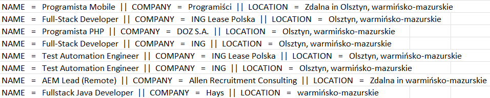

# Web-Scraper

Simple web scrapping app created with Java, Maven and with the use of Selenium framework and Apache POI library. 

## Introduction 
This is a training project which was created in order to develop my programming skills. This is a web scraping application, that reads job offers and their details from
job site "indeed.com" and writes them into Excel file. The user enters the position and workplace of interest, and the program searches for it in the firefox browser on "indeed.com" site. Then it reads the first 5 pages of the search results and writes collected data into Excel file. The result of the program operation is an Excel file called 'JobOffers' that contains collected data (name of the offer, name of the company, location) of which an individual offer consists.   

## Technologies
Project is created with:
* Java 
* Maven
* Selenium 4.0.0
* Apache POI 5.2.2

## Use

In order to use this program, the following files must be added to the project. Additionaly the paths included in the project have to be customized - atributes patheName and outputFilePathName have to be changed.
* selenium-devtools-v99-4.1.3  which may be downloaded here: https://repo1.maven.org/maven2/org/seleniumhq/selenium/selenium-devtools-v99/4.1.3/selenium-devtools-v99-4.1.3.jar
* selenium-server-4.1.3 
* geckodriver

## Result example

Below there is an example of the resulting excel file.

